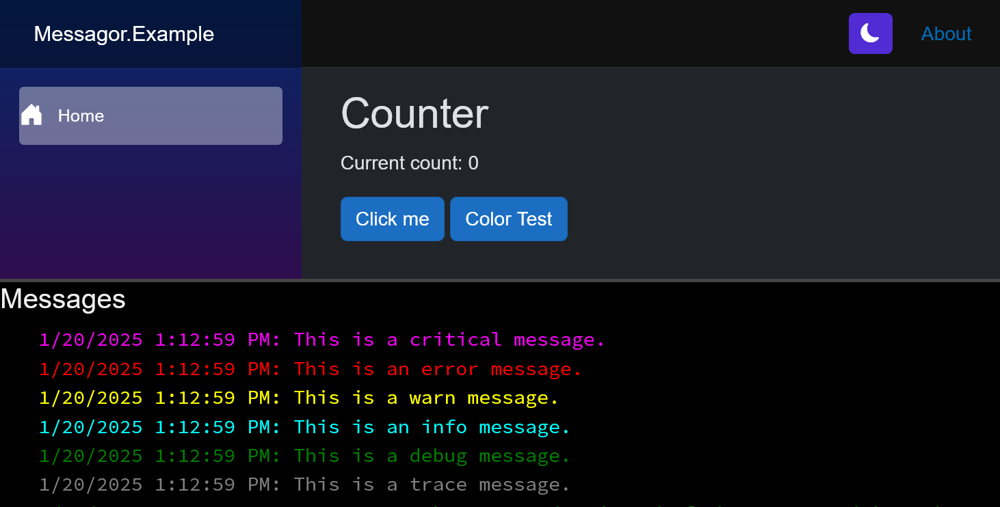

# Messagor
A messaging service for Blazor Server apps.

Messages can be published to the `MessageService`, and then rendered anywhere using the `<Messages>` component.

In the example application, we register a logging provider and log messages to a console.  The MessageService is registered as a singleton, and the console is in the MainLayout component, so all users can see all messages published by anyone.

